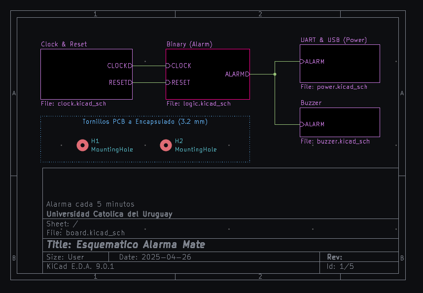
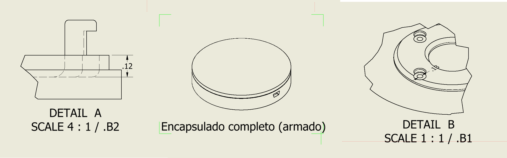

# Consigna
A nivel mundial, cerca de 100 millones de personas sufren de
deshidratación anualmente. Eso equivale a 3 personas por segundo!
Es nuestro deber recordar a la gente a mantenerse hidratada!

Objetivo: Hacer una alarma para tomar mate. Deben diseñar el esquemático y PCB (en KiCad), partiendo del circuito
dispuesto, y generar una bill of materials (BOM) completa.
# kicad - Esquematico y layout

Proceso de diseno placa conexiones electricas entre componentes, alineado de componentes, soldadura y manejo en gral, medición de señales, eventuales hotfixes. 
[consideraciones](/board/README.MD), [calculos](/board/README.MD#calculos), [BOM](/BOM.html)
# Autodesk Inventor - Encapsulado

Proceso de diseno del envolvente plastico
[consideraciones](/enclosure/README.md#consideraciones-housingipt)
